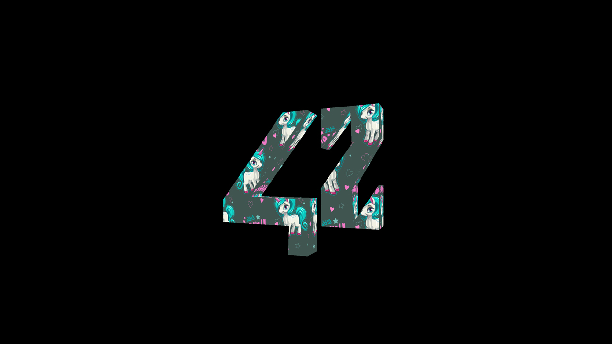

# Scop

The goal of this OpenGL project is to create a small program that will show a 3D object conceived with a modelisation program.
The 3D object is stored in a .obj file.

__NOTE:__
External libraries other than OpenGL, libm and libC are forbidden.
Libraries to load the 3D object, matrixes or to load shaders have to be coded by students.
OpenGL API is written in C, so only C is authorized in order to avoid automatic operations done by other languages.
A modern version of OpenGL is required: 4.0 minimum.

__Mandatory options:__
- Obj file parser
- 3D object displayed in perspective
- Automatical rotation around the object main vertical axis
- Using various shades, it must be possible to distinguish the various triangles
- The object can be moved on three axis, in both directions, using the keyboard
- A texture must be applied on the object with a smooth transition when a specific key is pressed

__Bonus options:__
- Triangulation of Polygons
- Configuration file
- BMP image file reader
- Subtle application of the texture (no stretching) [cubic and spheric mode selectable]
- Added light source which automatically rotates around the object
- Materials which change the interaction of light with the visible surface
- Added several Shaders including a Toon and Transparent mode
- Camera FPS mode
- X-Ray mode

  
   

_If you are interested in the complete code, please do not hesitate to contact me._
